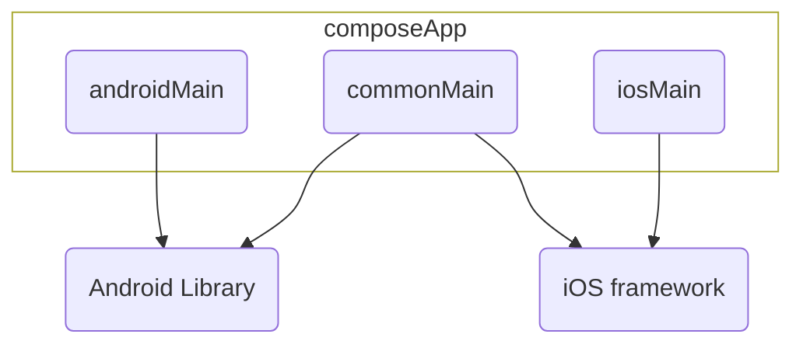

    

    
    
    

## Project structure

* `/composeApp` is for code that will be shared across Compose Multiplatform applications.
  Sub-folders:
    - `/commonMain` is for code that’s common for all targets.
    - Other folders are for Kotlin code that will be compiled for only the platform indicated in the
      folder name.
      For example, if you want to use Apple’s CoreCrypto for the iOS part of your Kotlin app,
      `/iosMain` would be the right folder for such calls.

* `/iosApp` contains iOS applications. Even if you’re sharing your UI with Compose Multiplatform,
  you need this entry point for your iOS app. This is also where you should add SwiftUI code for
  your project

## Versions

- Gradle: 8.7
- Android Studio: Jellyfish 2023.3.1
- Dev platform OS: Win10 22H2 19045.4291

# Local conventions

- Singular nouns in package names
- While project in active development state, unstructured fat-ass commits are allowed
- To keep aligned on the functional aspect of Jetpack Compose, the best writing approach is to
  inject instances directly into functions properties. This way allow to have default implementation
  with Koin, but keep open to inject different instances

# Dependencies overview

[Versions catalog](/gradle/libs.versions.toml)

- Settings multiplatform
    - I found more examples with that, later probably better to use data store
- Voyager
    - Looks more pragmatic, than compose-navigation. Although migrating from voyager to
      Decompose or compose-multiplatform is not so hard. View models are voyager's screen
      models until jetpack's view models
      in [release candidate state](https://developer.android.com/jetpack/androidx/releases/lifecycle)
- Koin

# Supporting Backend Project

[The backend that powers this app](https://github.com/Smart-Health-LLC/server)